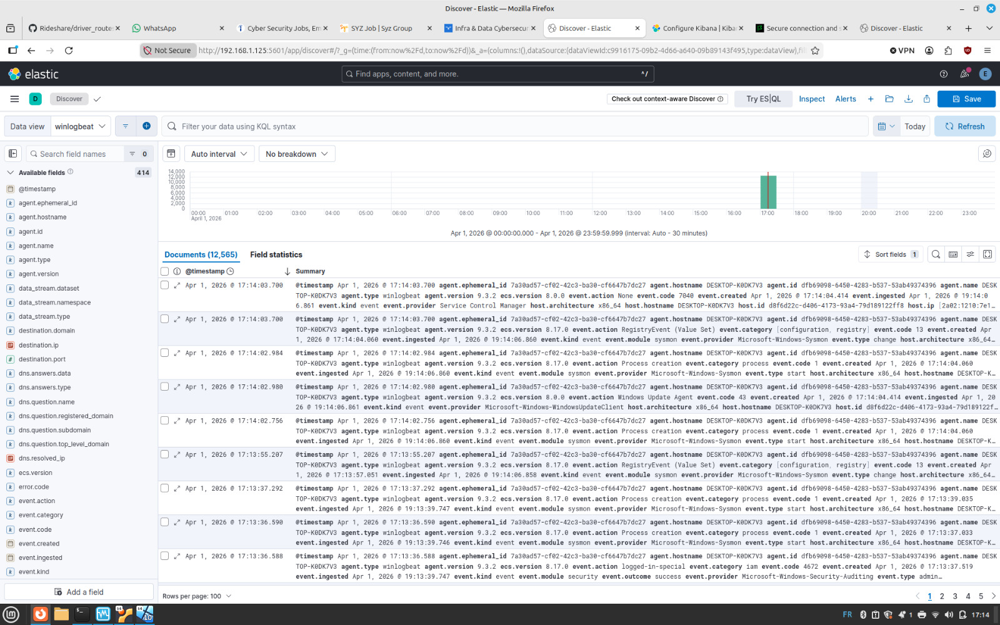
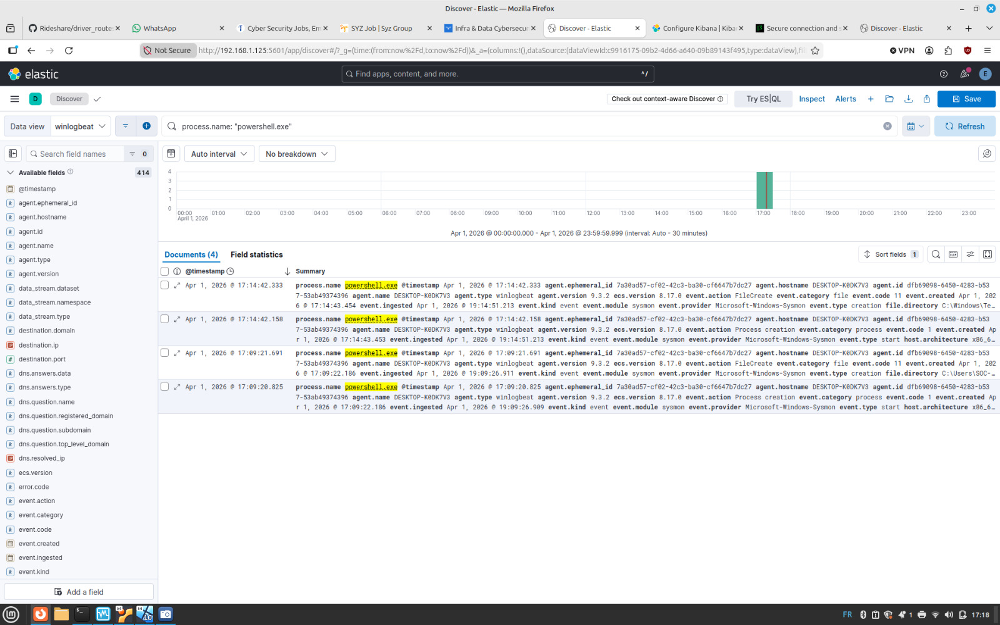

# 🔐 SIEM Lab – SOC Simulation (ELK Stack)

## 📌 Overview
This project consists of a self-built SIEM lab designed to simulate real-world Security Operations Center (SOC) workflows. The objective is to understand how logs are collected, analyzed, and used to detect suspicious activity.

The lab focuses on log ingestion, event analysis, and detection of security-relevant behavior.

---

## 🏗️ Architecture

The lab is composed of two virtual machines:

### 🖥️ Windows VM (Log Source)
- Sysmon (system and process monitoring)
- Winlogbeat (log forwarding)

### 🐧 Linux VM (SIEM Stack)
- Elasticsearch (log storage and indexing)
- Kibana (visualization and analysis)

### 🔄 Log Flow
Windows (Sysmon / Event Logs)  
→ Winlogbeat  
→ Elasticsearch  
→ Kibana  

---

## 📊 Log Ingestion & Analysis

Centralized ingestion of Windows and Sysmon logs via Winlogbeat into Elasticsearch, visualized and analyzed in Kibana.



---

## 🔍 PowerShell Activity Analysis

Filtered and analyzed PowerShell execution logs using Kibana to investigate process activity and identify potentially suspicious behavior.



---

## 🧠 SOC Workflow Simulation

This lab simulates core SOC analyst tasks:

- Log collection and centralization  
- Event filtering and analysis  
- Investigation of process activity  
- Identification of suspicious behavior  

---

## 🛠️ Technologies Used

- ELK Stack (Elasticsearch, Kibana)
- Sysmon
- Winlogbeat
- Windows Event Logs
- Virtual Machines

---

## Detection Use Case: Suspicious PowerShell Execution

### Objective
Detect suspicious PowerShell activity that may indicate malicious execution or attacker behavior.

### Data Sources
- Sysmon Event ID 1 (Process Creation)
- Winlogbeat
- Elasticsearch / Kibana

### Detection Logic
The detection focuses on identifying:
- PowerShell execution with encoded or obfuscated commands
- Use of suspicious flags such as -enc, -nop, or bypass options
- Unusual parent-child process relationships (e.g., Office spawning PowerShell)

### Example Query
```kql
event.code: "1" AND process.name: "powershell.exe" AND (
  process.args: "-EncodedCommand" OR
  process.args: "-enc" OR
  process.args: "-ExecutionPolicy" OR
  process.args: "Bypass" OR
  process.args: "-NoProfile" OR
  process.args: "-WindowStyle" OR
  process.args: "Hidden"
)
```
### Investigation Steps

1. Identify the parent process
2. Review command-line arguments
3. Check if user activity is expected for the user
4. Look for related events (network or repeated execution)
5. Determine if activity is benign or suspicious

### Outcome

This use case demonstrates how suspicious PowerShell execution can be detected and investigated in a SOC environment.

## 🎯 Key Learnings

- Understanding of SIEM architecture and log pipelines  
- Practical experience in log analysis and event filtering  
- Investigation of system and process activity  
- Hands-on exposure to SOC workflows  

---

## 🚧 Next Steps

- Authentication log analysis  
- Brute-force detection scenarios  
- Detection rule creation  
- Dashboard development  

---

## 👤 Author

Thomas Papas  
Cybersecurity Analyst (Junior) | SIEM | Python | Threat Detection

This project complements my other security projects, including a network reconnaissance toolkit and a cryptography implementation.
